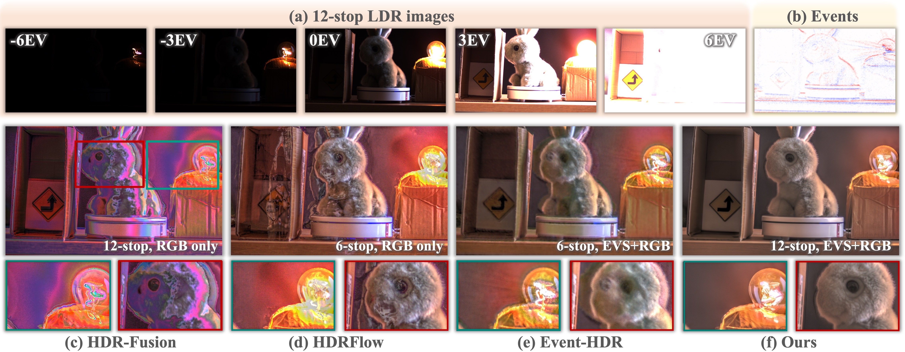

# Event-assisted 12-stop HDR Imaging of Dynamic Scene.
### [Project Page](https://openimaginglab.github.io/Event-Assisted-12stops-HDR/) | [Paper (coming soon)]()  

Shi Guo, Zixuan Chen, Ziran Zhang, Yutian Chen, Gangwei Xu, Tianfan Xue   

    

## Code
Coming soon 

## Citations
Coming soon